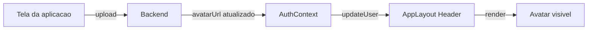

# Integracao Backend

## Payload esperado

```json
{
  "user": {
    "id": "123",
    "name": "Example User"
  },
  "roles": ["admin"],
  "features": {
    "users_enabled": true
  }
}
```

## Como o frontend consome

No fluxo de login/boot:

1. receber `roles`
2. receber `features`
3. aplicar nos contextos globais

Exemplo:

```ts
setUserRoles(response.roles)
setFeatureFlags(response.features || {})
```

## Onde integrar

- `AuthContext`: ponto de entrada de autenticacao e roles.
- `FeatureFlagContext`: armazenamento de flags em runtime.

## Regras importantes

- Backend deve ser a fonte oficial de roles e features.
- Frontend nao deve codificar permissao de negocio sensivel.
- Manter fallback seguro para ausencia de flag (`!== false`).

## AVATAR DO USUARIO

### Arquitetura do avatar

- O backend e a fonte de verdade do avatar.
- O frontend apenas consome `avatarUrl`.
- O template nao implementa upload de imagem.
- O template fornece atualizacao reativa via contexto (`updateUser`).

### Contrato de dados esperado

```ts
type User = {
  id: string
  name: string
  email: string
  avatarUrl?: string
}
```

### Fluxo frontend <-> backend



### Como a aplicacao consumidora deve implementar

1. Implementar UI de upload fora do template (qualquer pagina/componente).
2. Enviar arquivo para endpoint de avatar do backend.
3. Receber `avatarUrl` persistida.
4. Chamar:

```ts
updateUser({ avatarUrl: novaUrl })
```

### Limite de responsabilidade do template

- Nao criar ProfilePage obrigatoria.
- Nao impor botao de camera no header.
- Nao acoplar regra de produto ao template base.

### Boas praticas (mobile, performance e seguranca)

- **Mobile**: permitir camera/galeria, validar tamanho e orientar formato suportado.
- **Performance**: comprimir imagem antes do upload e usar tamanho de exibicao adequado.
- **Seguranca**: validar MIME/type e tamanho no backend, gerar URL assinada/publica conforme politica.
- **Governanca**: manter avatar por usuario autenticado (nunca por maquina/dispositivo).
